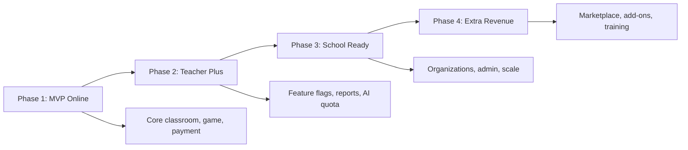

# แผนงาน 4 เฟส: ขึ้นออนไลน์และสร้างรายได้

## สมมติฐานหลัก

- ใช้ Render เป็นโฮสต์ตาม [render.yaml](render.yaml) ที่มีอยู่แล้ว
- ใช้ MongoDB Atlas เป็น production database ตาม [prisma/schema.prisma](prisma/schema.prisma)
- ใช้ Auth.js, Google login optional, credentials login และ role-based access ตาม [src/auth.ts](src/auth.ts) และ [src/auth.config.ts](src/auth.config.ts)
- ใช้ Stripe / Omise สำหรับรายได้ PLUS ตาม env ที่เตรียมไว้ใน [.env.example](.env.example)
- เปิดขายรอบแรกเป็น **ครูรายคน** ก่อน แล้วค่อยขยายเป็นระดับโรงเรียน

## เฟส 1: ก่อนอัปขึ้นระบบจริง

เป้าหมาย: เปิดใช้งานออนไลน์แบบ MVP ให้ครูใช้จริงได้โดยมีความเสี่ยงต่ำที่สุด และยังไม่เปิดฟีเจอร์หนัก/เสี่ยงทั้งหมด

### ระยะเวลาแนะนำ

- 2-4 สัปดาห์ ถ้าโฟกัสเฉพาะ core workflow และใช้ infra ที่เตรียมไว้แล้ว
- เป้าหมายไม่ใช่ “เปิดครบทุกอย่าง” แต่คือ “ครู 1 คนสามารถสอนจริงได้ตั้งแต่ต้นจนจบ 1 คาบ”

### User journey ที่ต้องผ่านให้ได้

- ครูสมัคร/เข้าสู่ระบบ
- ครูสร้างห้องเรียน
- ครูเพิ่มนักเรียนหรือแจก student code
- ครูสร้างชุดคำถามพื้นฐาน
- ครูโฮสต์เกมสด
- นักเรียนเข้าเล่นด้วย code/link
- ระบบบันทึกผลคะแนน/ประวัติ
- ครูดูผลและใช้งานซ้ำได้
- ครูอัปเกรด PLUS ผ่านช่องทางชำระเงินที่เลือก

### ฟีเจอร์ที่ควรเปิดก่อนสำหรับครู

- Login / Register / Google login ถ้าตั้ง OAuth เสร็จ
- Dashboard ครู
- สร้างห้องเรียน / เพิ่มนักเรียน
- สร้างชุดคำถามพื้นฐาน
- โฮสต์เกมสดหลัก 1-2 โหมดที่เสถียรที่สุด
- คะแนน / leaderboard / history เบื้องต้น
- Student portal ด้วย code/link
- ระบบแผน FREE / PLUS แบบง่าย
- หน้า upgrade และ checkout เฉพาะช่องทางที่พร้อมจริง

### ฟีเจอร์ MVP ที่ควรกำหนดเป็นแพ็กเกจ

- FREE:
  - สร้างห้องเรียนได้จำกัด
  - จำนวนนักเรียนจำกัด
  - จำนวนชุดคำถามจำกัด
  - เล่นเกมสดโหมดหลักได้
  - ไม่มี AI หรือ export ขั้นสูง
- PLUS:
  - เพิ่มจำนวนห้องเรียน/นักเรียน/ชุดคำถาม
  - เปิด export พื้นฐาน
  - เปิดฟีเจอร์ช่วยสอนที่พร้อมจริง เช่น template หรือ report เบื้องต้น
  - ยังไม่จำเป็นต้องเปิด OMR/AI/advanced analytics ในวันแรก

### ฟีเจอร์ที่ควรปิดไว้ก่อน

- AI generate questions ถ้ายังไม่ต้องการแบกค่า Gemini และ quota
- OMR / OpenCV ถ้ายังไม่ได้ทดสอบ device จริงหลายรุ่น
- ระบบ economy ขั้นสูง / audit ขั้นลึก / reconciliation สำหรับครูทั่วไป
- Negamon battle ขั้นสูง ถ้ายังมีการเปลี่ยน balancing ถี่
- Export หนัก ๆ เช่น PDF/Excel จำนวนมาก
- School Pro self-serve ให้เป็น “ติดต่อทีมงาน” ก่อน

### เหตุผลที่ควรปิดฟีเจอร์หนักก่อน

- ลดต้นทุน cloud/API ก่อนรู้ conversion จริง
- ลด surface area ของ bug ใน production
- ลดภาระ support เพราะผู้ใช้ชุดแรกมักเจอปัญหา onboarding มากกว่าฟีเจอร์ลึก
- ทำให้วัดได้ชัดว่า core classroom workflow ดีพอขายหรือยัง

### งานเทคนิคที่ต้องปิดก่อน deploy

- รัน `npm run build`, `npm run test:unit`, smoke test flow ครู-นักเรียน-เกม-ชำระเงิน
- ตั้ง production env ตาม [.env.example](.env.example): `DATABASE_URL`, `AUTH_SECRET`, `NEXTAUTH_URL`, `NEXT_PUBLIC_APP_URL`, `NEXT_PUBLIC_SOCKET_URL`, `SOCKET_IO_CORS_ORIGIN`, `ADMIN_SECRET`
- ตั้ง MongoDB Atlas production cluster และ network access จาก Render
- ตรวจ `/api/ready` ที่ใช้ใน [src/app/api/ready/route.ts](src/app/api/ready/route.ts)
- ตั้ง custom domain + SSL
- ตั้ง admin user / seed data ขั้นต่ำ
- ปิด dev/mock payment ใน production: ห้ามใช้ `BILLING_THAI_PROVIDER=mock` สำหรับรับเงินจริง

### Checklist ก่อนเปิดจริง

- Build ผ่านในเครื่องและบน Render
- `/api/ready` ได้ 200 หลัง deploy
- Login credentials ผ่าน
- Google OAuth ผ่าน ถ้าเปิด
- Teacher dashboard เปิดได้
- สร้างห้องเรียนและเพิ่มนักเรียนได้
- นักเรียนเข้า portal ได้โดยไม่ต้อง login teacher
- เล่นเกมสดจบอย่างน้อย 1 รอบ
- ข้อมูลคะแนนถูกบันทึกและไม่ซ้ำ
- Upgrade checkout สำเร็จในโหมด live หรือ production test ที่เทียบเท่า
- Webhook ชำระเงินให้สิทธิ์ PLUS ได้จริง
- Duplicate webhook ไม่เพิ่มสิทธิ์ซ้ำ
- Logout/session หมดอายุทำงานถูกต้อง
- Error page และ toast สำคัญเป็นภาษาไทยอ่านรู้เรื่อง

### งาน security ขั้นต่ำ

- ตรวจ route ฝั่งครูว่าต้องมี session และเช็ก `teacherId`
- ตรวจ route ฝั่งนักเรียนที่ใช้ code ว่าเข้าถึงเฉพาะข้อมูลที่ควรเห็น
- ตั้ง `AUTH_SECRET` ยาวและสุ่มจริง
- ตั้ง `SOCKET_IO_CORS_ORIGIN` ให้ตรง domain production
- ปิด mock payment และ dev secret
- ตรวจว่า `.env`, `.env.local`, secret key ไม่ถูก commit
- ตรวจ rate limit route สำคัญ: login, game start, payment start, AI generation

### งานเอกสาร/ธุรกิจขั้นต่ำ

- Landing page อธิบายว่า GameEdu ช่วยครูทำอะไร
- Pricing เบื้องต้น: FREE / PLUS / School Pro ติดต่อทีมงาน
- Terms of Service
- Privacy Policy
- Refund policy
- Contact/support channel เช่น Line OA, email, form
- คู่มือเริ่มต้น 5 นาทีสำหรับครู

### ค่าใช้จ่ายเริ่มต้นโดยประมาณ

- Hosting Render:
  - ทดลองจริงขั้นต่ำ: Starter ประมาณ 7 USD/เดือน แต่ RAM 512 MB อาจไม่พอสำหรับ Next.js + Socket.IO
  - แนะนำ MVP: Standard ประมาณ 25 USD/เดือน, RAM 2 GB
  - ถ้ามี concurrent สูงหรือ build/runtime หนัก: Pro ประมาณ 85 USD/เดือน, RAM 4 GB
- MongoDB Atlas:
  - ทดลอง/soft launch: Flex หรือ shared ประมาณ 0-30 USD/เดือน แต่ไม่เหมาะถ้าข้อมูลเริ่มมีมูลค่า
  - production ที่แนะนำ: M10 ประมาณ 57-60 USD/เดือนขึ้นไป ก่อน backup/storage เพิ่ม
- Domain: ประมาณ 400-1,000 บาท/ปี
- Email/domain mail optional: 0-300 บาท/เดือน แล้วแต่ provider
- Payment fee:
  - Stripe Thailand domestic card: ประมาณ 3.65% + 10 บาท/transaction
  - Stripe PromptPay: ประมาณ 1.65%/transaction ถ้าเปิดใช้ได้ในบัญชี
  - Omise PromptPay/card: โดยทั่วไปมีค่าธรรมเนียมต่อรายการ + VAT และ transfer fee ไปธนาคาร เช่น transfer ต่ำกว่า 2M บาทมีค่าธรรมเนียมประมาณ 30 บาท
- Monitoring optional:
  - เริ่มฟรีได้ เช่น Render logs + uptime monitor free
  - ภายหลังเพิ่ม Sentry/Log service ถ้าเริ่มมีลูกค้าจ่ายเงินจริง

### ตัวอย่างงบเริ่มต้นต่อเดือน

- แบบประหยัดเพื่อ soft launch:
  - Render Starter/Standard: 7-25 USD
  - MongoDB Flex/shared: 0-30 USD
  - Domain เฉลี่ยรายเดือน: 30-90 บาท
  - Monitoring ฟรี
  - รวมโดยประมาณ: 300-2,000 บาท/เดือน ยังไม่รวม payment fee
- แบบแนะนำถ้ารับเงินจริง:
  - Render Standard: 25 USD
  - MongoDB M10: 57-60 USD
  - Domain/email/monitoring: 100-500 บาท
  - รวมโดยประมาณ: 3,000-4,500 บาท/เดือน ยังไม่รวม payment fee
- แบบเริ่มรองรับหลายห้องพร้อมกัน:
  - Render Pro: 85 USD
  - MongoDB M10/M20: 60-150 USD
  - Monitoring/log เพิ่มเติม
  - รวมโดยประมาณ: 6,000-12,000 บาท/เดือนขึ้นไป

### ความพร้อมรองรับผู้ใช้โดยประมาณ

ต้องยืนยันด้วย load test แต่ประเมินเริ่มต้นแบบ conservative:

- Render Standard 2 GB + Mongo shared/Flex:
  - ครูใช้งานพร้อมกัน: 5-15 คน
  - นักเรียนพร้อมกันในกิจกรรมสด: 50-150 คน ถ้าเกมไม่ยิง event ถี่เกินไป
- Render Pro 4 GB + Mongo M10:
  - ครูใช้งานพร้อมกัน: 20-50 คน
  - นักเรียนพร้อมกัน: 200-500 คน ขึ้นกับ Socket.IO และ query pattern
- ถ้าต้องการหลายโรงเรียนพร้อมกัน ต้องทดสอบ WebSocket load และอาจต้องแยก worker/Redis adapter ในเฟส 3

### Load test ที่ควรทำในเฟส 1

- Scenario A: ครู 1 คน + นักเรียน 30 คน เล่นเกมสด 10 นาที
- Scenario B: ครู 3 คน + นักเรียนรวม 100 คน เล่นพร้อมกัน
- Scenario C: เปิด dashboard/report หลังเกมพร้อมกัน 10-20 browser
- วัดผล:
  - response time p95 ต่ำกว่า 1-2 วินาทีสำหรับหน้า/API ทั่วไป
  - socket disconnect ต่ำ
  - memory ไม่โตต่อเนื่องจน OOM
  - Mongo query ไม่ timeout
  - payment flow ไม่กระทบเกมสด

### เกณฑ์ผ่านเฟส 1

- ครูทดลองใช้งานจริงได้ 3-5 คนโดยไม่ต้องมี dev คอยแก้สด
- 1 คาบเรียนจบได้โดยไม่มีข้อมูลหาย
- Payment live/test-live ให้ PLUS ได้ถูกต้อง
- มี backup/export ข้อมูลพื้นฐานหรืออย่างน้อยมีแผน restore
- มีวิธีปิดฟีเจอร์เสี่ยงโดยไม่ต้อง deploy ใหม่ หรืออย่างน้อยปิดผ่าน env/plan gate ได้

## เฟส 2: ปรับระบบให้เหมาะสมและทยอยเปิดฟีเจอร์สำหรับครู

เป้าหมาย: ให้ครูใช้งานลื่นขึ้น ลดงาน support และเริ่มเพิ่มเหตุผลให้จ่าย PLUS

### ระยะเวลาแนะนำ

- 1-3 เดือนหลัง soft launch
- ทำแบบวนรอบ: วัดผล → แก้ pain point → เปิดฟีเจอร์ใหม่ทีละชุด → วัดผลซ้ำ

### โฟกัสหลักของเฟส 2

- ลด friction ของครูใหม่
- ทำให้ระบบขาย PLUS ได้ชัดขึ้น
- เพิ่ม reliability ของ payment/webhook/data
- เริ่มแยก “ฟีเจอร์ใช้ฟรี” กับ “ฟีเจอร์จ่ายเงิน” อย่างเป็นระบบ

### งานระบบ

- เพิ่ม feature flag/plan gate ให้ชัดเจน เช่น FREE, PLUS, PRO
- ตรวจทุก API route ว่าตรวจ role และ classroom ownership ครบ
- เพิ่ม audit log สำหรับ action สำคัญ: payment, plan change, student import/export, manual score
- เพิ่ม error monitoring และ alert สำหรับ webhook/payment failure
- ปรับ performance หน้า dashboard, classroom, economy และ history ที่ query เยอะ
- เพิ่ม scheduled cleanup สำหรับ session/game/battle ที่หมดอายุ

### รายละเอียดงานระบบที่ควรทำ

- Plan gate:
  - รวม logic limits ไว้ที่เดียว เช่น `getLimitsForUser`
  - แสดงข้อความ upgrade ที่เข้าใจง่ายเมื่อชน limit
  - ป้องกันทั้งฝั่ง UI และ API ไม่ใช่แค่ซ่อนปุ่ม
- Feature flag:
  - แยก `enabled`, `beta`, `hidden`, `planRequired`
  - ใช้ปิด AI/OMR/Negamon/economy ต่อ environment หรือ per classroom ได้
- Observability:
  - error tracking สำหรับ API และ client
  - log payment event แบบไม่เก็บ secret
  - dashboard usage: active teachers, active classrooms, games hosted, checkout started, checkout completed
- Data hygiene:
  - cleanup active games เก่า
  - cleanup battle sessions pending
  - TTL/audit log policy
  - export ข้อมูลสำคัญเมื่อครูร้องขอ

### ฟีเจอร์ที่ทยอยเปิด

- AI generate questions แบบจำกัด quota ต่อเดือนสำหรับ PLUS
- Export CSV/PDF แบบจำกัดตามแผน
- Economy/Negamon ให้เปิดเป็น optional module ต่อห้องเรียน
- OMR เปิดเป็น beta เฉพาะ PLUS/PRO หลังผ่าน test device
- Template ชุดคำถาม / duplicate / folder ขั้นสูง
- รายงานครู: attendance, score, engagement, student progress

### ลำดับเปิดฟีเจอร์แนะนำ

- ชุดที่ 1: UX และ productivity
  - duplicate question set
  - template question set
  - folder/search/sort ที่ใช้จริง
  - onboarding checklist
- ชุดที่ 2: Reports และ export
  - classroom summary
  - student progress
  - CSV export
  - PDF report แบบจำกัดขนาด
- ชุดที่ 3: AI แบบควบคุมต้นทุน
  - quota รายเดือน
  - จำกัดจำนวนคำถามต่อครั้ง
  - logging token/cost ต่อ user
  - fallback เมื่อ API ใช้งานไม่ได้
- ชุดที่ 4: Modules ที่ซับซ้อน
  - OMR beta
  - Economy advanced
  - Negamon advanced
  - Advanced analytics

### Pricing/Packaging ที่ควรทดลอง

- FREE:
  - เหมาะสำหรับครูลองใช้
  - จำกัดจำนวนห้อง/นักเรียน/ชุดคำถาม/ประวัติย้อนหลัง
- PLUS Teacher:
  - รายเดือน/รายปี
  - เพิ่ม limits และเปิด export/report/AI quota
- School Pro:
  - ยังเป็น contact sales
  - ไม่ต้องเปิด self-serve จนกว่า organization model พร้อม

### งาน support/feedback

- เพิ่ม feedback button ใน dashboard
- เก็บเหตุผล cancel หรือไม่ upgrade
- สร้าง help docs สั้น ๆ:
  - วิธีสร้างห้อง
  - วิธีให้นักเรียนเข้าเล่น
  - วิธีดูคะแนน
  - วิธีแก้ปัญหา login/payment
- ตั้ง SLA ภายใน เช่น bug payment ตอบภายใน 24 ชม.

### เกณฑ์ผ่านเฟส 2

- มีครูทดลองใช้จริง 10-30 คน
- payment webhook สำเร็จซ้ำได้และไม่ให้สิทธิ์ซ้ำ
- มี dashboard ดู error / usage / conversion เบื้องต้น
- ลด bug blocking เหลือเฉพาะ minor UX
- มี conversion จาก FREE ไป PLUS แม้ยังน้อย แต่พิสูจน์ว่ามี willingness to pay
- ค่าใช้จ่าย AI/export/report ต่อผู้ใช้ไม่เกินราคาที่เก็บได้

## เฟส 3: ปรับให้เหมาะสมกับระดับโรงเรียน

เป้าหมาย: เปลี่ยนจากขายรายครูเป็นขายให้โรงเรียนหรือทีมครูหลายคน

### ระยะเวลาแนะนำ

- เริ่มหลังมีครูใช้งานจริงและรู้ workflow ชัดแล้ว
- โดยทั่วไป 3-6 เดือน เพราะกระทบ data model, role, billing และ support

### สิ่งที่ต่างจากขายรายครู

- โรงเรียนต้องการ control, policy, report, เอกสาร และความน่าเชื่อถือมากกว่าฟีเจอร์เกมอย่างเดียว
- การตัดสินใจซื้ออาจเป็นผู้บริหาร ไม่ใช่ครูที่ใช้จริง
- ต้องมีข้อมูลสรุปการใช้งานและผลลัพธ์ที่นำเสนอได้

### งานระบบสำหรับโรงเรียน

- เพิ่ม Organization / School workspace
- Role เพิ่มเติม: owner, school admin, teacher, co-teacher, student
- เชิญครูเข้าทีม / จัดห้องเรียนร่วมกัน
- Dashboard ผู้บริหาร: ภาพรวมครู ห้องเรียน นักเรียน การใช้งาน
- Policy / quota รายโรงเรียน เช่น จำนวนครู, นักเรียน, ห้องเรียน, storage
- Billing แบบ invoice/manual สำหรับ School Pro
- Data export / data deletion / retention ตามนโยบายโรงเรียน

### Data model ที่ควรวางเพิ่ม

- Organization/School:
  - ชื่อโรงเรียน
  - owner/admin
  - plan/quota
  - billing contact
  - data retention policy
- Membership:
  - userId
  - organizationId
  - role
  - status
- Classroom ownership:
  - ผูกห้องเรียนกับ organization
  - รองรับ co-teacher
  - รองรับย้ายห้องเรียนระหว่างครูในโรงเรียน
- Audit:
  - invite teacher
  - remove teacher
  - export data
  - change student data
  - billing/admin changes

### ฟีเจอร์สำหรับโรงเรียน

- Admin dashboard:
  - จำนวนครู active
  - จำนวนห้องเรียน active
  - จำนวน game sessions
  - จำนวนนักเรียน
  - usage แยกตามครู/ระดับชั้น
- School reports:
  - classroom engagement
  - assignment/game participation
  - attendance summary ถ้าใช้ attendance
  - export รายเดือน
- Teacher management:
  - invite via email/link
  - deactivate teacher
  - transfer classroom
  - role co-teacher
- Compliance:
  - export/delete student data
  - privacy contact
  - retention policy
  - audit trail

### Infrastructure

- ขยับ MongoDB เป็น M10/M20 พร้อม backup
- Render อย่างน้อย Pro หรือแยก service ตามภาระงาน
- พิจารณา Redis/Socket.IO adapter ถ้าต้องรองรับหลาย instance
- เพิ่ม automated backup checklist และ disaster recovery runbook

### Scaling architecture ที่ควรวาง

- ระยะเริ่มโรงเรียน:
  - 1 web service
  - MongoDB M10/M20
  - Render Pro
  - monitoring + backup
- ระยะหลายโรงเรียน:
  - แยก web กับ background worker
  - เพิ่ม Redis หรือ adapter สำหรับ Socket.IO ถ้ามีหลาย instance
  - queue สำหรับงานหนัก เช่น export, AI batch, PDF
  - CDN/storage สำหรับไฟล์แนบ ถ้ามีรูป/เอกสารเยอะ
- ระยะ enterprise:
  - staging environment
  - automated migration/deploy checklist
  - admin audit log immutable มากขึ้น
  - incident response runbook

### Sales/operations สำหรับโรงเรียน

- เตรียม one-page proposal
- เตรียม demo script 15 นาที
- เตรียมราคา School Pro:
  - ตามจำนวนครู
  - ตามจำนวนนักเรียน
  - หรือ package รายโรงเรียน
- เตรียมเอกสาร:
  - ใบเสนอราคา
  - ใบกำกับ/ใบเสร็จตามรูปแบบที่ทำได้
  - PDPA/privacy summary
  - security summary

### เกณฑ์ผ่านเฟส 3

- รองรับโรงเรียน pilot 1-3 แห่ง
- รองรับครู 20-100 คนและนักเรียน 500-3,000 คนต่อระบบแบบมี monitoring
- มีเอกสาร onboarding, privacy, SLA เบื้องต้น, support channel
- มี admin โรงเรียนที่ดูภาพรวมได้โดยไม่ต้องให้ทีม dev ช่วยดึงข้อมูล
- มีระบบแยกข้อมูล/สิทธิ์ระหว่างโรงเรียนชัดเจน
- มีแผน backup/restore ที่ทดลองกู้คืนแล้วอย่างน้อย 1 ครั้ง

## เฟส 4: เพิ่มฟีเจอร์หารายได้จากรูปแบบพื้นฐาน

เป้าหมาย: เพิ่ม ARPU และช่องทางรายได้โดยไม่ทำให้ core classroom ซับซ้อนเกินไป

### ระยะเวลาแนะนำ

- เริ่มหลัง core product และ payment เสถียร
- ควรมีข้อมูล usage จริงก่อนตัดสินใจว่าช่องทางไหนคุ้มที่สุด

### ช่องทางรายได้เพิ่มเติม

- Marketplace ชุดคำถาม/เทมเพลต: ครูซื้อหรือแลกเปลี่ยน premium packs
- Premium AI quota: ซื้อ token/credit เพิ่มสำหรับสร้างข้อสอบหรือสรุปผล
- Add-on modules:
  - OMR Pro
  - Advanced analytics
  - School admin dashboard
  - Gamification/Negamon premium skins/items สำหรับห้องเรียน ไม่ใช่ pay-to-win กับเด็ก
- Training / onboarding package สำหรับโรงเรียน
- White-label หรือ custom deployment สำหรับโรงเรียนใหญ่
- Data insights package แบบ aggregate ไม่ระบุตัวตน

### รายละเอียดแต่ละช่องทาง

- Marketplace:
  - เริ่มจาก curated content ที่ทีมทำเองก่อน
  - ต่อมาค่อยเปิดให้ครูขาย/แชร์
  - ต้องมี review/moderation กันเนื้อหาไม่เหมาะสม
  - รายได้: ขาย pack, subscription content, หรือ revenue share
- AI credits:
  - เหมาะถ้า AI มี adoption สูงใน PLUS
  - ต้องมี cost tracking ต่อ user
  - กำหนดราคาเป็น credit pack เช่น 100/300/1000 generations
- Add-on modules:
  - OMR Pro สำหรับโรงเรียนที่สอบกระดาษ
  - Advanced analytics สำหรับหัวหน้ากลุ่มสาระ/ผู้บริหาร
  - Gamification premium สำหรับครูที่ใช้เกมเป็นประจำ
- Training:
  - onboarding 1-2 ชั่วโมง
  - workshop ใช้เกมในห้องเรียน
  - setup package สำหรับโรงเรียน
- White-label/custom:
  - เหมาะกับโรงเรียนใหญ่หรือองค์กร
  - ควรราคาแพงพอชดเชย maintenance เฉพาะราย

### Guardrails

- รายได้จากเด็กต้องระวังมาก: ไม่ควรขาย microtransaction ให้เด็กโดยตรงในบริบทโรงเรียน
- ฟีเจอร์ gamification ที่จ่ายเงินควรเป็นของครู/โรงเรียน เช่น theme, template, module ไม่ใช่ความได้เปรียบของนักเรียน
- ต้องมี refund policy และ privacy policy ชัดเจน

### Metrics ที่ใช้เลือกฟีเจอร์หารายได้

- Conversion: ผู้ใช้ FREE กี่เปอร์เซ็นต์ไป PLUS
- Activation: ครูสร้างห้อง/เล่นเกมภายใน 7 วันหรือไม่
- Retention: ครูกลับมาใช้อีกใน 30 วันหรือไม่
- Cost per active teacher: hosting + DB + AI + support
- Support burden: ฟีเจอร์ใดสร้างคำถาม/ปัญหามากที่สุด
- Willingness to pay: ครูยอมจ่ายกับอะไรจริง ไม่ใช่แค่บอกว่าน่าสนใจ

### เกณฑ์ผ่านเฟส 4

- มีรายได้มากกว่า hosting + database + payment fee + support ขั้นต่ำ
- มีอย่างน้อย 1 ช่องทางรายได้เสริมที่ขายได้ซ้ำ
- ฟีเจอร์เสริมไม่ทำให้ core classroom ช้าหรือซับซ้อนขึ้น
- มี pricing ที่อธิบายง่ายและไม่ทำให้ครูสับสน

## ลำดับงานแนะนำ 30-60-90 วัน

### 30 วันแรก

- ปิดเฟส 1 ให้ขึ้นออนไลน์ได้จริง
- เปิดเฉพาะ core teacher workflow
- Stripe หรือ Omise เลือกหนึ่งช่องทางให้จบก่อน ไม่ต้องเปิดพร้อมกันทั้งคู่
- ทำ load test เบื้องต้น 1 ห้องเรียน 30, 50, 100 นักเรียน

### 60 วัน

- เก็บ feedback ครูจริง
- ปรับ UX onboarding, classroom, game session
- เปิด PLUS features ที่ควบคุมต้นทุนได้
- เพิ่ม monitoring/payment audit

### 90 วัน

- เตรียม pilot โรงเรียน
- เพิ่ม organization model หรืออย่างน้อย school-level reporting
- สรุป pricing package: FREE, PLUS Teacher, School Pro
- สร้าง landing/pricing/docs/support flow

## Mermaid ภาพรวม

## คำแนะนำเชิงตัดสินใจ

- เริ่มขายด้วย **PLUS สำหรับครู** ก่อน เพราะระบบมี foundation อยู่แล้วและ scope เล็กกว่า School Pro
- ใช้ Render Standard + MongoDB Flex/M10 ตามงบ หากมีเงินจริงควรไป M10 เพื่อ backup และ performance ที่มั่นใจกว่า
- Payment ให้เลือก **Omise/PromptPay หรือ Stripe อย่างใดอย่างหนึ่งก่อน** แล้วทำให้ webhook/entitlement แข็งแรงที่สุด
- ฟีเจอร์ที่ต้นทุนสูง เช่น AI/OMR/advanced analytics ให้เปิดหลังมีผู้ใช้จริงและวัดต้นทุนต่อครูได้แล้ว