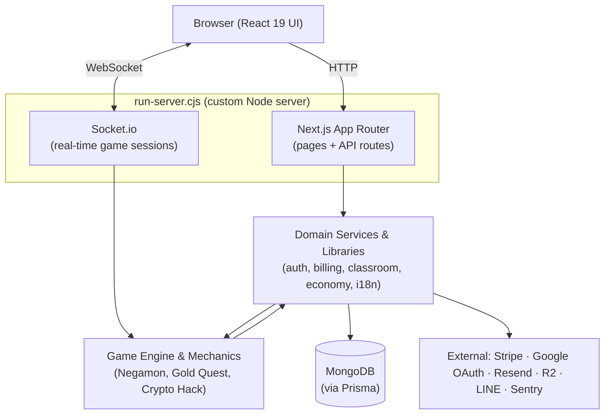
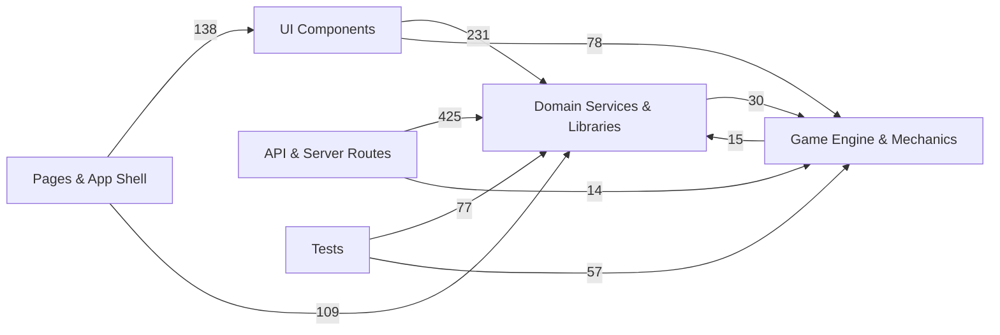
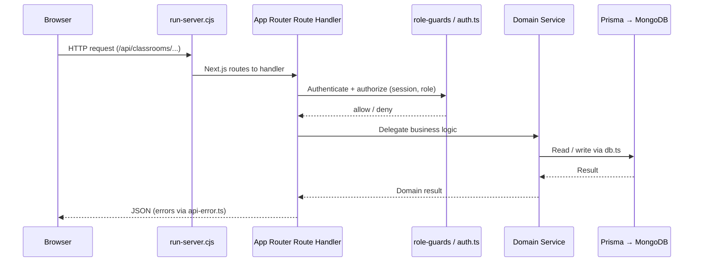
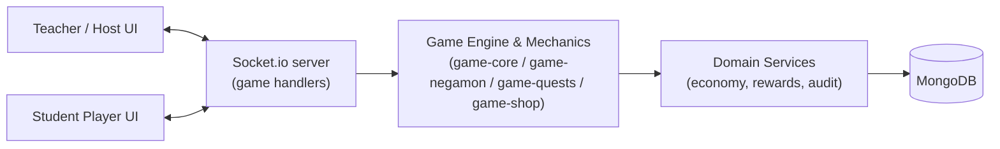
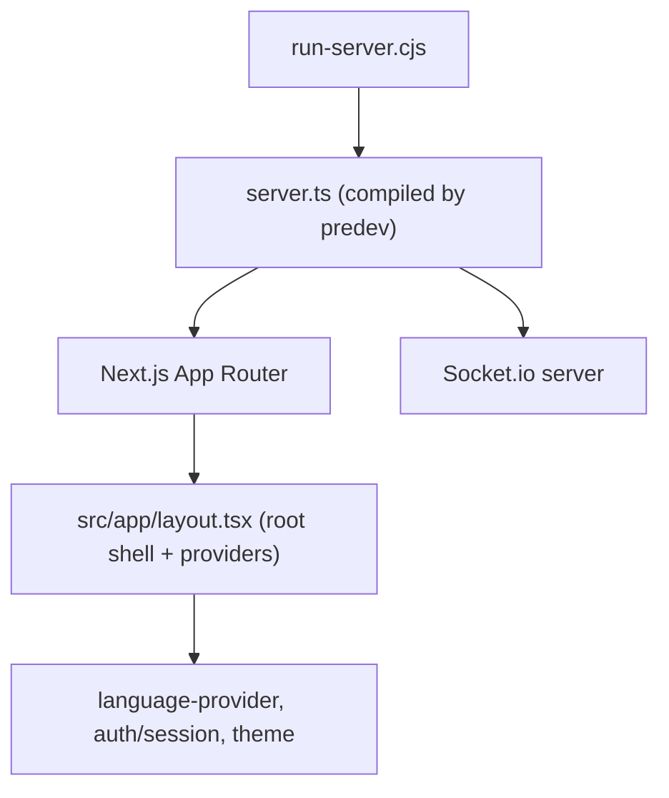

# GameEdu — Architecture

This document describes how GameEdu is structured, how a request flows through the
system, and which modules are the load-bearing dependencies you should treat with care.

> The dependency figures below were derived from a static analysis of the codebase
> (1,290 nodes / 2,870 edges across 996 source files). Treat them as a map, not gospel —
> re-generate when the structure changes significantly.

---

## 1. High-Level Overview

GameEdu is a **Next.js 16 (App Router)** application served by a **custom Node server**
(`run-server.cjs`) that attaches **Socket.io** to the same HTTP server, so real-time
game traffic and normal HTTP requests share one origin. Persistence is **MongoDB via
Prisma**, and auth is **Auth.js / NextAuth v5**.

---

## 2. Layered Architecture

The code is organized into nine layers. The table shows each layer's size and role.

| Layer | Files | Responsibility |
|-------|------:|----------------|
| **UI Components** | 194 | React components & hooks: classroom, student, negamon, board, set editor, OMR, live games, shared UI kit |
| **Domain Services & Libraries** | 162 | Server-side services & shared libs: auth, billing, classroom/student/teacher domains, economy, storage, LINE bot, i18n, OMR logic, utilities |
| **Documentation** | 125 | System plans, conventions, QA checklists, runbooks, contributor/deploy docs |
| **API & Server Routes** | 105 | App Router route handlers, webhooks, server actions |
| **Game Engine & Mechanics** | 87 | Negamon battles, Gold Quest, Crypto Hack, quests, shop, economy, socket game handlers |
| **Build, Ops & Infrastructure** | 65 | Server bootstrap, instrumentation, ops/dev scripts, build/deploy config, CI |
| **Pages & App Shell** | 52 | Page components, layouts, app-level shells (admin/dashboard/student/play/auth/public) |
| **Tests** | 203 | Unit, integration, route-authorization, and Playwright e2e tests + helpers |
| **Data & Schema** | 3 | Prisma MongoDB schema, seed, tabular content data |

---

## 3. Dependency Flow Between Layers

Static analysis of `imports` edges reveals a **clean, mostly one-directional dependency
graph** — UI and routes depend on shared services, not the other way around.

**Top cross-layer import flows (by edge count):**

| From → To | Imports | Meaning |
|-----------|--------:|---------|
| API & Server Routes → Domain Services | 425 | Route handlers delegate to shared services (the dominant flow) |
| UI Components → Domain Services | 231 | Components consume shared helpers, types, i18n |
| Pages & App Shell → UI Components | 138 | Pages compose components |
| Pages & App Shell → Domain Services | 109 | Pages read services directly (auth/guards/data) |
| UI Components → Game Engine | 78 | Game UIs bind to engine state |
| Tests → Domain Services | 77 | Service-level test coverage |
| Domain Services ↔ Game Engine | 30 / 15 | A small bidirectional coupling — watch this boundary |

> **Healthy signal:** `Domain Services` is the hub everything depends on, and it rarely
> depends back on UI or routes. The only two-way edge is **Services ↔ Game Engine**
> (30 in / 15 out) — the main place to keep an eye on for tangling.

---

## 4. Load-Bearing Modules (High Centrality)

These files are imported by the most other files. **A change here ripples widely — they
deserve the strongest test coverage and most careful review.**

| Imported by | Module | Role |
|------------:|--------|------|
| 117 | `src/components/providers/language-provider.tsx` | i18n context provider (wraps the whole app) |
| 115 | `src/lib/db.ts` | Prisma client singleton — the database entry point |
| 106 | `src/lib/api-error.ts` | Standardized API error handling / error codes |
| 86 | `src/lib/utils.ts` | Shared utilities (incl. `cn` class helper) |
| 76 | `src/auth.ts` | Auth.js configuration & session helpers |
| 76 | `src/components/ui/button.tsx` | Base UI primitive |
| 48 | `src/lib/role-guards.ts` | Role-based access control |
| 46 | `src/lib/classroom-utils.ts` | Classroom domain helpers |
| 37 | `src/lib/game-negamon/index.ts` | Negamon engine barrel |
| 33 | `src/lib/security/audit-log.ts` | Audit logging |
| 29 | `src/lib/game-core/index.ts`, `src/lib/types/{game,negamon}.ts` | Game core & shared game types |
| 24 | `src/lib/student-login-code.ts` | Student login-code logic |

> **Rule of thumb:** before modifying any module in this table, check its dependents in
> the knowledge-graph dashboard (`/understand-dashboard`) and run the relevant domain
> checks (e.g. `npm run check:auth`, `npm run check:classroom-core`).

The **most dependency-heavy** components (highest import out-degree) — i.e. the most
likely to break when their dependencies change — are
`classroom-dashboard.tsx` (31), `add-assignment-dialog.tsx` (19),
`StudentDashboardClient.tsx` (19), `negamon-settings.tsx` (19), and
`classroom-table.tsx` (19).

---

## 5. Request Lifecycle (HTTP)

Key conventions enforced along this path:

- **Auth & roles** go through shared helpers (`auth.ts`, `role-guards.ts`, `auth-guards.ts`).
- **Errors** are normalized through `api-error.ts` (see
  [error-code-contract.md](error-code-contract.md)).
- **Routes** use canonical plural paths like `/api/classrooms/...` (see
  [route-pattern-guide.md](route-pattern-guide.md)).

---

## 6. Real-Time Game Flow (Socket.io)

The custom server (`run-server.cjs` → `server.ts`) attaches Socket.io to the same HTTP
server. Live games (Gold Quest, Crypto Hack, Negamon Battle) communicate over WebSocket
rather than HTTP route handlers.

- **Game Engine** holds the authoritative game state and rules (server-authoritative
  Negamon battles — see `docs/negamon-battle-phase-3-server-authority.md`).
- Rewards and economy mutations flow back through **Domain Services** (the
  Services ↔ Game Engine boundary), which persist via `db.ts` and write `audit-log`.
- Review checklist: [socket-review-checklist.md](socket-review-checklist.md).

---

## 7. Data & Persistence Layer

- **Schema:** `prisma/schema.prisma` (MongoDB datasource) defines all models and is the
  single source of truth (`defines_schema` → `prisma/seed.ts`).
- **Access:** all reads/writes go through the `src/lib/db.ts` Prisma singleton
  (imported by 115 files) — never instantiate `PrismaClient` ad hoc.
- **Generation:** `prisma generate` runs on `postinstall`; production deploy runs
  `prisma db push` via `render.yaml`.

---

## 8. Cross-Cutting Concerns

| Concern | Where it lives |
|---------|----------------|
| **i18n** | `components/providers/language-provider.tsx` + `lib` translation lookups (most-imported module — keep strings out of code; run `npm run check:i18n`) |
| **Auth & roles** | `auth.ts`, `lib/role-guards.ts`, `lib/auth-guards.ts`, `lib/authorization/` |
| **Error handling** | `lib/api-error.ts`, `lib/ui-error-messages.ts` |
| **Security & audit** | `lib/security/audit-log.ts`, rate limiting, route-authorization tests |
| **Billing** | `lib/billing/` (Stripe subscriptions + PromptPay) |
| **Observability** | Sentry (`instrumentation.ts`), audit log |
| **Storage** | Cloudflare R2 (with local fallback in dev) |

---

## 9. Entry Points & Boot Sequence

| Entry point | Purpose |
|-------------|---------|
| `run-server.cjs` | Production & dev server entry (`npm run dev` / `npm start`) |
| `server.ts` | Boots Next.js + Socket.io (TypeScript, compiled by `predev`) |
| `src/app/layout.tsx` | Root layout — mounts global providers |
| `instrumentation.ts` | Sentry/observability hooks |

---

## 10. Architectural Conventions

See the companion documents:

- [architecture-conventions.md](architecture-conventions.md) — layering rules (page /
  service / component separation, read/write rules)
- [route-pattern-guide.md](route-pattern-guide.md) — API route patterns
- [role-semantics.md](role-semantics.md) — `USER` vs `STUDENT` vs `TEACHER` vs `ADMIN`
- [error-code-contract.md](error-code-contract.md) — error response contract
- [operational-safety-contract.md](operational-safety-contract.md) — operational guarantees

> 🔎 To explore this architecture interactively (clickable graph, layers, guided tour),
> run `/understand-dashboard` and open the knowledge graph.
