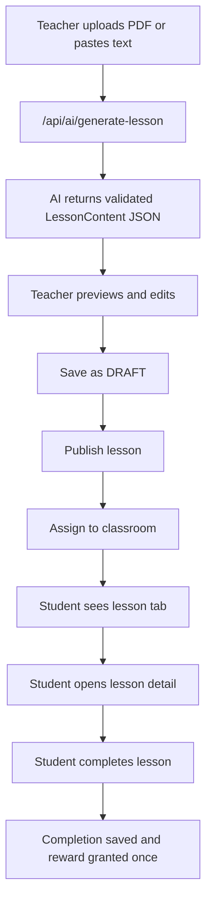

# Lessons / Generate Lesson Development Plan

วันที่อัปเดต: 2026-06-03

เป้าหมายของงานนี้คือทำระบบบทเรียนให้ครูสร้างบทเรียนจากไฟล์หลักสูตรหรือข้อความด้วย AI, ตรวจแก้, publish, assign ให้ห้องเรียน และให้นักเรียนเรียน/กดจบ/รับรางวัลได้ โดยแยก scope นี้ออกจากงาน LINE, Negamon Battle และฟีเจอร์อื่นที่ยังปนใน worktree

## Current Scope

งานใน scope:

- Generate Lesson จาก PDF/text ด้วย Gemini
- Validate AI response และ lesson content JSON
- CRUD lesson ของครู
- Assign lesson ให้ classroom
- Student lesson list/detail ผ่าน login code
- Student complete lesson และบันทึก completion
- Teacher progress visibility
- QA + deploy-safe checklist เฉพาะกอง Lessons

ไม่อยู่ใน scope รอบนี้:

- LINE bot commands/reminders
- Negamon Battle V4
- OMR
- Billing/Pricing
- Export lesson เป็น PDF ขั้นสูง

## Product Flow



## Data Contract

Lesson content must keep this shape:

```ts
type LessonContentPayload = {
  objectives: string[];
  sections: Array<{
    id: string;
    heading: string;
    content: string;
    examples: Array<{ title: string; body: string }>;
  }>;
  keyTerms: Array<{ term: string; definition: string }>;
  summary: string;
  estimatedMinutes: number;
};
```

Validation rules:

- `objectives` must be non-empty strings
- `sections` must have at least 1 item
- each section must have `id`, `heading`, `content`
- each example must have `title`, `body`
- `summary` must be non-empty
- `estimatedMinutes` must be finite
- generated lesson title must be non-empty
- invalid AI JSON returns `INVALID_AI_RESPONSE`, not `INTERNAL_ERROR`

## Phase 1: Deploy-Safe Backend Foundation

Status: in progress

Checklist:

- [x] Add `INVALID_AI_RESPONSE` to app error codes
- [x] Add lightweight validation for AI generated lesson structure
- [x] Return `INVALID_AI_RESPONSE` when Gemini returns invalid JSON
- [x] Add `LessonContentPayload` validator
- [x] Validate `POST /api/lessons`
- [x] Validate `PATCH /api/lessons/[id]`
- [x] Add student lesson routes using `/api/student/[code]/lessons`
- [x] Use login-code variants for student lesson list/detail/complete
- [x] Validate `quizScore` as integer `0..100`
- [x] Add targeted tests for Generate Lesson and student lesson routes
- [x] Add targeted tests for teacher lesson CRUD routes
- [x] Add targeted tests for classroom lesson assign route
- [x] Confirm Prisma generated client includes `Lesson`, `LessonAssignment`, `LessonCompletion`

Acceptance criteria:

- `npx tsc --project tsconfig.server.json --noEmit` passes
- targeted Lessons tests pass
- Generate Lesson invalid AI payload does not break deploy
- Student cannot access unpublished lesson
- Completion reward is granted only once

## Phase 2: Teacher Lesson Workspace

Status: complete (2026-06-03)

Pages:

- `/dashboard/lessons`
- `/dashboard/lessons/create`
- `/dashboard/lessons/[id]/edit`

Checklist:

- [x] Lesson list shows title, subject, grade, status, assigned classes
- [x] Create page supports text-only generation
- [x] Create page supports parsed PDF generation via existing parse-file route
- [x] Create page handles `INVALID_AI_RESPONSE` with a clear teacher message
- [x] Preview lets teacher edit title/objectives/sections/key terms/summary
- [x] Save DRAFT flow works
- [x] Publish/unpublish flow works
- [x] Assign dialog lists only teacher-owned classrooms
- [x] Assign is idempotent and does not duplicate assignment
- [x] Delete lesson confirms before deleting

UX requirement:

- ครูควรเข้าใจทันทีว่าอยู่ขั้นไหน: `Generate -> Review -> Save -> Publish -> Assign`
- ถ้า AI ล้มเหลว ต้องบอกวิธีแก้ง่ายๆ เช่น ลดจำนวนหัวข้อ, ใช้ข้อความแทน PDF, ลองใหม่
- อย่าให้ครูกด publish ถ้า content ไม่ผ่าน validation

## Phase 3: Student Lesson Experience

Status: complete (2026-06-03)

Pages/routes:

- `/api/student/[code]/lessons`
- `/api/student/[code]/lessons/[lessonId]`
- `/api/student/[code]/lessons/[lessonId]/complete`
- `/student/[code]/lessons/[lessonId]`
- Student dashboard tab: `Lessons`

Checklist:

- [x] Student lesson list fetches via student-code route
- [x] Student lesson detail fetches via student-code route
- [x] Student complete route stores completion
- [x] First completion grants XP/Gold once
- [x] Student dashboard tab shows loading/error states
- [x] Lesson card shows completed state clearly
- [x] Lesson detail shows objectives, sections, examples, key terms, summary
- [x] Complete button disables after success
- [x] Re-opening completed lesson shows completion state
- [x] Empty state explains that no lessons are assigned yet
- [x] Student quiz generation endpoint (login-code auth, `/api/student/[code]/lessons/[lessonId]/quiz`)

Acceptance criteria:

- นักเรียนที่มีรหัสถูกต้องเห็นเฉพาะ lesson ที่ assign ให้ห้องของตัวเอง
- unpublished lesson ไม่แสดงและเปิดไม่ได้
- completion ไม่ให้รางวัลซ้ำ
- mobile layout ไม่ล้นหรือซ้อน

## Phase 4: Teacher Progress Visibility

Status: complete (2026-06-03)

Goal:

ครูต้องเห็นว่านักเรียนคนไหนเรียนบทไหนจบแล้ว และคะแนน quiz/summary เป็นอย่างไร

Checklist:

- [x] Add progress summary on lesson edit page
- [x] Show assigned classrooms
- [x] Show completion count per classroom
- [x] Show student completion list
- [x] Show average quiz score when available
- [x] Add quick link from classroom page to lesson progress
- [x] Add export basic CSV for lesson completions

Suggested API:

- `GET /api/lessons/[id]/progress`
- returns assigned classrooms, student counts, completions, quiz scores

## Phase 5: Quiz Integration

Status: complete (2026-06-03)

Goal:

สร้าง quiz ท้ายบทจาก lesson content และบันทึกผลลง `LessonCompletion.quizScore`

Checklist:

- [x] Add "Generate quiz from lesson" action
- [x] Reuse existing question normalization from `/api/ai/generate-questions`
- [x] Store quiz draft inside lesson content
- [x] Student can answer quick quiz after lesson
- [x] Completion can include quiz score
- [x] Teacher can see quiz average

Decision needed:

- Option A: lesson quiz เป็น lightweight in-lesson quiz
- Option B: generate เป็น Assignment/Quiz ปกติใน classroom

Recommendation:

เริ่มด้วย Option A เพื่อให้ Lesson MVP จบเร็ว แล้วค่อยเชื่อมกับ Assignment/Quiz ในรอบถัดไป

## Phase 6: QA And Release Gate

Checklist before commit/deploy:

- [x] `npm test -- src/__tests__/ai-generate-lesson-route.test.ts src/__tests__/student-lessons-routes.test.ts src/__tests__/teacher-lessons-routes.test.ts src/__tests__/classroom-lessons-routes.test.ts src/__tests__/lesson-progress-export-route.test.ts src/__tests__/lesson-quiz-routes.test.ts`
- [x] Add/run teacher lesson CRUD tests
- [x] Add/run classroom lesson assign tests
- [x] `npx tsc --project tsconfig.server.json --noEmit`
- [x] targeted eslint for changed Lesson files
- [ ] Manual QA teacher create/save/publish/assign/generate quiz/progress export
- [ ] Manual QA student open/take quiz/complete/reopen
- [x] Confirm no LINE/Negamon files are included in Lesson-only deploy candidate list

Lesson-only deploy candidate files should be limited to:

- `src/app/api/ai/generate-lesson/route.ts`
- `src/app/api/lessons/**`
- `src/app/api/classrooms/[id]/lessons/**`
- `src/app/api/student/[code]/lessons/**`
- `src/app/dashboard/lessons/**`
- `src/app/student/[code]/lessons/**`
- `src/components/student/student-lessons-tab.tsx`
- `src/components/student/student-dashboard-main-tabs.tsx` only if staging just the Lessons hunk
- `src/components/student/student-dashboard-tab-nav.tsx`
- `src/components/layout/sidebar.tsx`
- `src/lib/lessons/**`
- `src/lib/api-error.ts`
- `src/lib/ui-error-messages.ts`
- `src/__tests__/ai-generate-lesson-route.test.ts`
- `src/__tests__/student-lessons-routes.test.ts`

Do not include:

- `src/lib/line-bot/**`
- LINE docs/checklists
- Negamon Battle V4 files
- `dist/**`
- `.claude/**`, `.kiro/**`, `.agents/skills/**`
- local debug files

## Open Risks

- Worktree currently has unrelated LINE and Negamon changes; staging must be file-by-file
- Existing student dashboard files may contain mixed Lessons and unrelated hunks
- Full build should be run only after staging/isolating Lesson scope or after dirty worktree is intentionally resolved
- Gemini output can be malformed; route now handles invalid JSON, but prompt quality still needs manual QA

## Next Best Step

Phase 5 complete. Move to Phase 6 QA and release gate:

1. Run full Lesson-only test set
2. Run targeted eslint for all Lesson files
3. Run `npx tsc --project tsconfig.server.json --noEmit`
4. Manual QA teacher create/save/publish/assign/generate quiz/progress export
5. Manual QA student open lesson/take quiz/complete/reopen
6. Confirm no LINE/Negamon files are included in Lesson-only deploy
