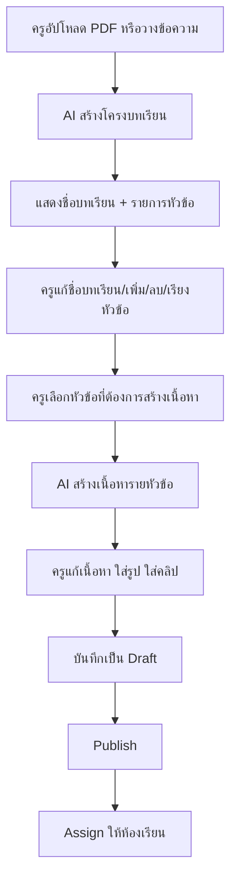

# 38) AI Lesson Outline-First Generation Plan

Last updated: 2026-06-13
Status: Planning

## Goal

ปรับระบบสร้างบทเรียนให้ AI ไม่สร้างเนื้อหาทั้งบทในครั้งเดียวอีกต่อไป แต่เปลี่ยนเป็น flow แบบ 2 ขั้น:

1. AI วิเคราะห์ PDF หรือข้อความ แล้วสร้างเฉพาะ `บทเรียน` และ `หัวข้อที่จะเรียน`
2. ครูเลือกหัวข้อ แล้วให้ AI สร้างเนื้อหารายละเอียดของหัวข้อนั้น

รอบนี้ยังไม่ปรับระบบแบบทดสอบ/quiz ตามคำสั่งล่าสุด แบบทดสอบจะเก็บไว้เป็น phase ถัดไป

## Current Problem

ระบบเดิม `/api/ai/generate-lesson` สร้าง lesson content ครบชุดทันที:

- วัตถุประสงค์
- ส่วนเนื้อหา
- ตัวอย่าง
- คำศัพท์สำคัญ
- สรุป
- เวลาประมาณ

ข้อเสียคือครูยังไม่ได้เลือกโครงบทเรียนก่อน แต่ AI สร้างเนื้อหาเต็มมาเลย ทำให้:

- ครูคุมขอบเขตบทเรียนยาก
- เนื้อหาอาจยาวหรือกว้างเกิน
- แก้ทีหลังเยอะ
- เพิ่มรูป/คลิปตามหัวข้อยาก
- การสร้าง quiz ในอนาคตผูกกับเนื้อหาที่ยังไม่ผ่านการจัดโครง

## Target Flow



## New AI Responsibilities

### Step 1: Generate Lesson Outlines

AI สร้างเฉพาะ:

- ชื่อบทเรียน
- คำอธิบายสั้นของบทเรียน
- รายการหัวข้อที่จะเรียน
- ลำดับหัวข้อ
- คำอธิบายสั้นของแต่ละหัวข้อ
- ระดับชั้น/วิชา ถ้าพอเดาได้จากเอกสาร

AI ห้ามสร้างเนื้อหายาวในขั้นนี้

Expected response shape:

```ts
type LessonOutlineDraft = {
  title: string;
  description?: string;
  subject?: string;
  gradeLevel?: string;
  topics: Array<{
    id: string;
    title: string;
    description?: string;
    order: number;
  }>;
};

type LessonOutlineBatchDraft = {
  lessons: LessonOutlineDraft[];
};
```

Validation:

- `title` ต้องไม่ว่าง
- `topics` ต้องมีอย่างน้อย 1 หัวข้อ
- ทุก topic ต้องมี `id`, `title`, `order`
- topic title ต้องไม่ซ้ำกันในบทเรียนเดียวกัน
- จำกัดจำนวนหัวข้อเริ่มต้น เช่น 3-10 หัวข้อ เพื่อไม่ให้ AI แตกย่อยเกินไป

### Step 2: Generate Topic Content

เมื่อครูเลือกหัวข้อ AI จึงสร้างเนื้อหาเฉพาะหัวข้อนั้น:

- วัตถุประสงค์
- หัวข้อ/ส่วนเนื้อหา
- ตัวอย่าง
- คำศัพท์สำคัญ
- สรุป

Expected response shape:

```ts
type LessonTopicContentDraft = {
  topicId: string;
  objectives: string[];
  sections: Array<{
    id: string;
    heading: string;
    content: string;
    examples: Array<{
      title: string;
      body: string;
    }>;
  }>;
  keyTerms: Array<{
    term: string;
    definition: string;
  }>;
  summary: string;
};
```

Validation:

- `topicId` ต้องตรงกับหัวข้อที่มีอยู่ใน outline
- `objectives` มีอย่างน้อย 1 ข้อ
- `sections` มีอย่างน้อย 1 ส่วน
- `summary` ต้องไม่ว่าง
- เนื้อหาต้องไม่สร้าง quiz หรือคำถามท้ายบทใน phase นี้

## Content Editing Requirements

ครูต้องแก้ไขเนื้อหาได้หลัง AI สร้าง:

- แก้ชื่อบทเรียน
- เพิ่ม/ลบ/เรียงหัวข้อ
- แก้ชื่อหัวข้อ
- แก้วัตถุประสงค์
- แก้เนื้อหาแต่ละ section
- เพิ่ม/ลบตัวอย่าง
- เพิ่ม/ลบคำศัพท์สำคัญ
- แก้สรุป
- ใส่รูปในหัวข้อหรือ section
- ใส่คลิปในหัวข้อหรือ section

Media fields ที่ควรเพิ่มใน content model:

```ts
type LessonMediaBlock = {
  id: string;
  type: "image" | "video";
  url: string;
  title?: string;
  caption?: string;
  source?: "upload" | "media_library" | "external_url";
};
```

ตัวเลือกจัดเก็บ media:

- ใช้ media library เดิมถ้ามีไฟล์อยู่แล้ว
- รองรับ external video URL เช่น YouTube
- รองรับรูปจาก upload หรือ URL
- เก็บ media เป็น block ที่ผูกกับ topic/section ไม่ผูกทั้งบทอย่างเดียว

## Proposed Data Contract

เพื่อไม่พังของเดิมทันที ให้ใช้ content shape ใหม่แบบขยายจากของเดิม:

```ts
type LessonContentV2 = {
  schemaVersion: "lesson_content_v2";
  outline: LessonOutlineDraft;
  topics: Array<{
    id: string;
    title: string;
    description?: string;
    order: number;
    contentStatus: "empty" | "generated" | "edited";
    objectives: string[];
    sections: Array<{
      id: string;
      heading: string;
      content: string;
      examples: Array<{ title: string; body: string }>;
      media?: LessonMediaBlock[];
    }>;
    keyTerms: Array<{ term: string; definition: string }>;
    summary: string;
    media?: LessonMediaBlock[];
  }>;
  estimatedMinutes?: number;
};
```

Compatibility decision:

- อ่าน lesson content เก่าได้ต่อไป
- lesson ใหม่ใช้ `schemaVersion: "lesson_content_v2"`
- หน้า student ต้อง render ได้ทั้ง V1 และ V2 ระหว่าง migration
- ห้ามลบ quiz fields ตอนนี้ แต่ UI รอบนี้ไม่ต้องสร้าง quiz ใหม่

## UX Plan

### Create Page

หน้า `/dashboard/lessons/create` เปลี่ยนเป็น wizard:

1. Source
   - เลือก PDF หรือข้อความ
   - กด `สร้างโครงบทเรียน`

2. Outline Review
   - แสดงชื่อบทเรียน
   - แสดงหัวข้อเป็นรายการเรียงลำดับ
   - ครูแก้ เพิ่ม ลบ เรียงหัวข้อได้
   - กด `สร้างเนื้อหาหัวข้อนี้`

3. Topic Content Editor
   - เลือกหัวข้อด้านซ้าย
   - ด้านขวาแสดง content ของหัวข้อนั้น
   - ถ้ายังไม่มีเนื้อหา แสดงปุ่มให้ AI สร้าง
   - ถ้ามีแล้ว แก้ไขได้
   - เพิ่มรูป/คลิปได้

4. Save Draft
   - บันทึก lesson V2 เป็น Draft
   - ยังไม่ publish อัตโนมัติ

### Edit Page

หน้า `/dashboard/lessons/[id]/edit` ต้องรองรับ:

- outline panel
- topic list
- per-topic content editor
- media blocks
- publish/assign flow เดิม
- progress เดิม
- quiz section เดิมอาจซ่อนหรือพักไว้จนกว่าจะสั่งปรับ

### Student Page

หน้า `/student/[code]/lessons/[lessonId]` ต้องแสดง V2 แบบ:

- ชื่อบทเรียน
- รายการหัวข้อ
- เนื้อหาตามหัวข้อ
- รูป/คลิปที่ครูใส่
- วัตถุประสงค์/ตัวอย่าง/คำศัพท์/สรุปของแต่ละหัวข้อ
- ปุ่ม complete เดิม

## Backend Plan

### New Routes

เพิ่ม route แยกแทนการยัดทุกอย่างใน `/api/ai/generate-lesson`:

```txt
POST /api/ai/lessons/generate-outline
POST /api/ai/lessons/generate-topic-content
```

หรือถ้าต้องการคุม migration ง่าย:

```txt
POST /api/ai/generate-lesson-outline
POST /api/ai/generate-lesson-topic
```

Recommendation:

ใช้ route ใหม่ภายใต้ `/api/ai/lessons/*` เพื่อให้แยกจาก generator เดิมชัดเจน

### Existing Routes To Update

- `POST /api/lessons`
  - รับ `LessonContentV2`
  - validate schemaVersion

- `PATCH /api/lessons/[id]`
  - แก้ content V2 ได้
  - ห้าม publish ถ้า topic ยังไม่มี content อย่างน้อย 1 หัวข้อ

- `GET /api/lessons/[id]`
  - คืน content V1/V2 ได้

- Student lesson routes
  - render/return V2 ได้

## Phase Breakdown

### Phase 1: Contracts And Validation

Checklist:

- [x] เพิ่ม type `LessonOutlineDraft`
- [x] เพิ่ม type `LessonTopicContentDraft`
- [x] เพิ่ม type `LessonContentV2`
- [x] เพิ่ม validator สำหรับ outline
- [x] เพิ่ม validator สำหรับ topic content
- [x] เพิ่ม validator สำหรับ full lesson V2
- [x] เขียน tests สำหรับ valid/invalid payload
- [x] ยืนยันว่า content V1 ยังอ่านได้

Completed: 2026-06-13

Implementation notes:

- Contracts and validators live in `src/lib/lessons/lesson-content.ts`
- Unit tests live in `src/lib/lessons/__tests__/lesson-content.test.ts`
- `isLessonContentPayload()` now accepts both legacy V1 lesson content and new V2 content
- Teacher lesson route tests were updated to mock current media usage sync and confirm legacy V1 content still works through existing create/update routes

Acceptance criteria:

- [x] invalid AI outline ไม่ทำให้ route 500
- [x] invalid topic content ไม่ทำให้ route 500
- [x] lesson V1 เดิมยังไม่พัง

### Phase 2: Outline Generation API

Checklist:

- [x] สร้าง `POST /api/ai/lessons/generate-outline`
- [x] รองรับ input จาก text
- [x] รองรับ input ที่ parse จาก PDF แล้ว
- [x] prompt บังคับ AI แบ่งเป็นบทเรียนก่อน และแต่ละบทเรียนมีหัวข้อของตัวเอง
- [x] validate JSON response
- [x] return error `INVALID_AI_RESPONSE` ถ้าโครงไม่ถูก
- [x] เพิ่ม targeted tests

Completed: 2026-06-13

Implementation notes:

- Route lives in `src/app/api/ai/lessons/generate-outline/route.ts`
- Tests live in `src/__tests__/ai-generate-lesson-outline-route.test.ts`
- The route accepts text-only input and parsed-PDF input from `/api/ai/parse-file`
- The prompt explicitly forbids objectives, sections, examples, key terms, summaries, and quiz questions
- AI JSON is parsed, normalized lightly, and validated with `isLessonOutlineBatchDraft()`
- The route now returns `{ lessons: LessonOutlineDraft[] }`, where each lesson has its own topic list
- Invalid JSON or invalid outline shape returns `INVALID_AI_RESPONSE`

Acceptance criteria:

- [x] AI ไม่ส่ง content ยาวใน outline step
- [x] ครูได้หัวข้อที่แก้ไขได้ก่อนสร้างเนื้อหา

### Phase 3: Topic Content Generation API

Checklist:

- [x] สร้าง `POST /api/ai/lessons/generate-topic-content`
- [x] input ต้องมี outline + topicId + source text
- [x] prompt ให้ AI สร้างเฉพาะหัวข้อที่เลือก
- [x] response มีวัตถุประสงค์, sections, examples, keyTerms, summary
- [x] ห้ามสร้าง quiz/question ใน response
- [x] validate response
- [x] เพิ่ม targeted tests

Completed: 2026-06-13

Implementation notes:

- Route lives in `src/app/api/ai/lessons/generate-topic-content/route.ts`
- Tests live in `src/__tests__/ai-generate-lesson-topic-content-route.test.ts`
- The route requires a valid `LessonOutlineDraft`, matching `topicId`, and source text or parsed-PDF data
- The prompt includes the full outline but instructs AI to generate content only for the selected topic
- The route explicitly forbids quiz/questions/answers/choices fields in the generation prompt
- AI JSON is parsed, normalized lightly, and validated with `isLessonTopicContentDraft()`
- Invalid JSON, mismatched topic content, or incomplete topic content returns `INVALID_AI_RESPONSE`

Acceptance criteria:

- [x] สร้างเนื้อหาได้ทีละหัวข้อ
- [x] topicId ไม่ตรง outline ต้อง reject
- [x] response ไม่มี quizDraft

### Phase 4: Teacher Create Wizard

Checklist:

- [x] ปรับ `/dashboard/lessons/create` เป็น wizard
- [x] Step Source: PDF/text
- [x] Step Outline Review: เลือกบทเรียน แล้วแก้ชื่อบทเรียนและหัวข้อของบทเรียนนั้น
- [x] Step Topic Editor: เลือกบทเรียนและหัวข้อ แล้วสร้างเนื้อหาเฉพาะหัวข้อ
- [x] เพิ่มสถานะ `empty/generated/edited` ต่อหัวข้อ
- [x] เพิ่ม save draft ด้วย content V2
- [x] กัน publish ใน create step

Completed: 2026-06-13

Implementation notes:

- `/dashboard/lessons/create` now uses a 3-step wizard: Source, Lesson Review, Topic Editor
- Source step calls `POST /api/ai/lessons/generate-outline`
- AI now splits the source into multiple lesson drafts first
- Each generated lesson draft owns its own topic list
- Topic Editor lets the teacher choose the lesson and then the topic to generate content for
- Topic Editor calls `POST /api/ai/lessons/generate-topic-content` for the selected lesson/topic only
- Topic state is stored as `empty`, `generated`, or `edited`
- Save now creates only a Draft with `schemaVersion: "lesson_content_v2"`
- The create page no longer calls publish from the save action

Acceptance criteria:

- [x] ครูสร้าง outline ก่อนเสมอ
- [x] ครูเลือกหัวข้อแล้วค่อยสร้างเนื้อหา
- [x] บันทึก draft ได้แม้ยังสร้างเนื้อหาไม่ครบทุกหัวข้อ

### Phase 5: Media Editing

Checklist:

- [x] เพิ่ม media block ใน topic
- [x] เพิ่ม media block ใน section
- [x] เพิ่ม UI ใส่รูปจาก URL หรือ media library
- [x] เพิ่ม UI ใส่คลิปจาก URL
- [x] ตรวจ URL เบื้องต้น
- [x] student page render image/video ได้

Completed: 2026-06-13

Implementation notes:

- `LessonMediaBlock` now supports `mediaId` for media library references
- `/dashboard/lessons/create` includes media editing for topic-level and section-level blocks
- Teachers can add image/video blocks from direct URL
- Teachers can attach image, video, or YouTube media from the existing media library picker
- URL blocks require basic `http://` or `https://` validation before being added
- `/student/[code]/lessons/[lessonId]` renders V2 topic media and section media
- Student renderer supports image URLs, direct video URLs, and YouTube watch/short links converted to embeds

Acceptance criteria:

- [x] ครูใส่รูปในหัวข้อได้
- [x] ครูใส่คลิปในหัวข้อได้
- [x] นักเรียนเห็น media ใน lesson detail
- [x] media ไม่ทำให้ layout mobile แตก

### Phase 6: Edit, Publish, Assign Compatibility

Checklist:

- [x] หน้า edit อ่าน V2 ได้
- [x] หน้า edit ยังอ่าน V1 ได้
- [x] publish guard สำหรับ V2
- [x] assign flow เดิมใช้ต่อได้
- [x] classroom lesson progress ใช้ต่อได้
- [x] student complete ใช้ต่อได้

Completed: 2026-06-13

Implementation notes:

- `/dashboard/lessons/[id]/edit` now branches V1 and V2 editing so legacy lesson content and outline-first content do not share the same editor assumptions
- V2 edit mode shows a topic list, selected topic editor, objectives, sections, key terms, and topic summary
- V1 edit mode keeps the existing media picker, objectives, sections, key terms, summary, and quiz draft UI
- `PATCH /api/lessons/[id]` now blocks publishing V2 content until at least one topic has generated/edited publishable content
- Existing classroom assign and student complete routes remain content-shape agnostic and are covered by targeted route tests

Acceptance criteria:

- [x] lesson V1 เดิมยังใช้งานได้
- [x] lesson V2 publish/assign ได้
- [x] student complete ไม่พัง

Verification:

- [x] `npm.cmd test -- src/lib/lessons/__tests__/lesson-content.test.ts src/__tests__/teacher-lessons-routes.test.ts src/__tests__/classroom-lessons-routes.test.ts src/__tests__/student-lessons-routes.test.ts`
- [x] `npm.cmd run predev`
- [x] `npm.cmd run build`

### Phase 7: QA And Release Gate

Checklist:

- [x] Run targeted lesson tests
- [x] Run `npm.cmd run predev`
- [x] Run `npm.cmd run build`
- [ ] Manual QA: create from text
- [ ] Manual QA: create from PDF
- [ ] Manual QA: generate outline only
- [ ] Manual QA: generate one topic content
- [ ] Manual QA: edit text
- [ ] Manual QA: add image
- [ ] Manual QA: add video
- [ ] Manual QA: save draft
- [ ] Manual QA: publish
- [ ] Manual QA: assign
- [ ] Manual QA: student opens lesson
- [ ] Manual QA: student completes lesson

Status: automated release gate passed on 2026-06-13; manual localhost QA is still pending before commit/push/deploy.

Automated verification:

- [x] `npm.cmd test -- src/__tests__/ai-generate-lesson-outline-route.test.ts src/__tests__/ai-generate-lesson-topic-content-route.test.ts src/lib/lessons/__tests__/lesson-content.test.ts src/__tests__/teacher-lessons-routes.test.ts src/__tests__/classroom-lessons-routes.test.ts src/__tests__/student-lessons-routes.test.ts src/__tests__/lesson-progress-export-route.test.ts src/__tests__/lesson-quiz-routes.test.ts`
- [x] `npm.cmd run predev`
- [x] `npm.cmd run build`

Manual QA notes:

- Do not deploy this plan until the teacher create wizard and student lesson detail are manually checked in localhost.
- Required local flow: create from text, create from PDF, generate outline, generate one topic, edit text/media, save draft, publish, assign, open as student, complete lesson.
- The browser-facing manual checks are intentionally not marked complete yet.

## Out Of Scope For This Plan

- Quiz generation
- Auto grading
- Assignment conversion
- Course/module marketplace
- AI image generation
- Auto video transcription
- Parent visibility

## Open Decisions

1. จะให้ครูสร้างเนื้อหาครบทุกหัวข้อก่อน publish หรือ publish ได้ถ้ามีอย่างน้อย 1 หัวข้อพร้อม?
2. รูป/คลิปจะใช้ media library เดิมเท่านั้น หรือให้วาง URL ได้ก่อน?
3. PDF ต้นฉบับควรถูกเก็บอ้างอิงกับ lesson ไหม?
4. estimatedMinutes ควรคำนวณรวมจากทุก topic หรือให้ครูกรอกเอง?

## Recommended First Implementation Order

1. เพิ่ม contracts + validators
2. เพิ่ม outline generation route
3. เพิ่ม topic content generation route
4. ปรับ create page เป็น wizard
5. เพิ่ม editor สำหรับ topic content
6. เพิ่ม media block ขั้นต่ำ
7. ปรับ student renderer
8. รัน QA เต็มก่อน commit/deploy
